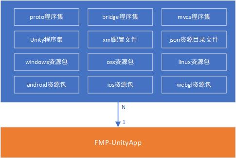

# UnityApp


FMP Unity Application（简称UnityApp）作为FMP解决方案中的视觉呈现终端部分，能灵活的搭配使用FMP方案构建出的标准模块，快速制作数字内容的交互终端。


## 功能特性（Features）

### 虚拟环境（Vendor）

为了在开发和实际使用中，能使用一个UnityApp切换不同的内容呈现，特别设计了虚拟环境的功能，vendor是一个文件结构，包含以下层级

```
|+ vendor/
  |+ configs/
  |+ modules/
  |+ uabs/
  |+ themes/
  |- Bootloader.xml
  |- Upgrade.xml
```

在UnityApp的数据持久化路径下，可以存在多个虚拟环境，在应用启动的时候，可以通过配置文件或命令行参数，指定激活一个虚拟环境作为此次启动的数据目录。

### 应用升级 （Application Upgrade）

TODO

### 框架更新（Framework Update）

FMP构建出的标准模块，在发布后，会存放在仓库中（Repository），在UnityApp运行时，可以通过模块的更新，从仓库中获取指定版本的模块。

### 资源聚合（Asset Syndication）

TODO

### 许可证（License）

TODO

### 模块管理（Module Management）

UnityApp本身只是一个基础应用，为了使用FMP方案中构建出的标准模块。需要在UnityApp启动后，将模块载入运行时。 FMP方案中的标准模块，均基于FMP-MVCS架构，具有统一的结构和接口。

### 定制化引导 （Customizable Bootload）

FMP程序运行时，会按照定义的引导步骤（Steps），依次加载对应的模块，并加载模块对应的资源。

### 衍生应用（Clone Application）

UnityApp是一个母体应用，不推荐在生产环境中使用。 在UnityApp的基础上，使用自定义的程序图标，程序名称，密钥等所创建出的应用，统称为衍生应用。在生产环境中推荐使用衍生应用。

### 业务分支 (Business Branch)

业务分支主要用于在构建衍生应用时，替换敏感数据，分为源文件替换和资源文件替换两种方式。

* 源文件替换 在构建时，替换业务分支的源文件，这种方式适合直接使用母体应用构建衍生应用的情况。
* 资源文件替换 在启动时，读取工程中的资源文件，解析后，重写业务分支的敏感数据，这种方式适合将母体应用编译为库的情况。

### 皮肤（Skin）

TODO


## 架构设计 （Architecture Design）

### 架构总览

FMP-UnityApp使用模块化动态加载作为核心技术。在程序运行时，动态加载指定的程序集、配置、资源等文件。

<figure><figcaption></figcaption></figure>

一个Unity项目最大化构建完成的模块，包含以下内容：

* proto程序集

protobuf定义的接口编译完成的程序集，用于同后端进行网络通信。被Unity程序集引用。

* bridge程序集

mvcs中视图层的桥接接口，用于mvcs程序集适配不用的UI系统。被Unity程序集引用。

* mvcs程序集

数据、视图、控制、服务四层核心框架，用于运行时将所有模块统合在一起，为跨模块跨层访问提供支撑。被Unity程序集引用。

* Unity程序集

Unity项目的编译完成的程序集。包含Unity层级的业务逻辑。

* xml配置文件

Unity程序集使用的配置文件，包含样式的定义。

* json资源目录文件

Unity程序集使用的资源文件的清单，用于Unity程序集加载文本、图片、视频等文件内容。

* windows资源包

Unity程序使用的Windows平台的AssetBundle。

* osx资源包

Unity程序使用的OSX平台的AssetBundle。

* linux资源包

Unity程序使用的Linux平台的AssetBundle。

* android资源包

Unity程序使用的Android平台的AssetBundle。

* ios资源包

Unity程序使用的IOS平台的AssetBundle。

* webgl资源包

Unity程序使用的WebGL平台的AssetBundle。


## 流程设计（Design）

### 生命周期

UnityApp的生命周期为启动（Launcher）、选择（Selector）、过场（Splash）、框架更新（Framework Update）、资源聚合（Asset Syndication）、开始（Startup）六个阶段。

*   启动阶段

    此阶段完成以下工作：

    * 加载应用配置文件，如果不存在，创建一个默认的配置文件存放到数据持久化路径下。
    * 解析命令行参数，如果指定了vendor，使用此参数值作为激活的vendor。
    * 如果命令行参数没有指定vendor，则使用配置文件中激活的vendor。
    * 进入选择阶段。
*   选择阶段

    此阶段完成以下工作：

    * 如果有激活的vendor，直接进入过场阶段。
    * 如果没有激活的vendor，显示选择界面后等待用户选择后进入过场阶段。
*   过场阶段

    此阶段完成以下工作：

    * 加载激活的vendor的皮肤。
    * 根据应用配置文件调整画质。
    * 检查许可证。
    * 根据许可证状态决定是否进入升级阶段。
    * 进入框架更新阶段。
*   框架更新阶段

    此阶段完成以下工作：

    * 根据vendor中的配置中的更新策略进行更新。
    * 更新过程会将所有的更新文件存放到临时文件夹中。
    * 更新成功后，使用临时文件加中的文件覆盖需要更新的文件。
    * 更新失败后，不做任何数据的更改。
    * 进入资源聚合阶段。
*   资源聚合阶段

    此阶段完成以下工作：

    * 根据vendor中的配置中的更新策略进行更新。
    * 更新资源文件夹中的文件。
    * 进入开始阶段。
*   开始阶段

    此阶段完成以下工作：

    * 使用应用配置文件中的配置，调整界面适配。
    * 初始化FMP-MVCS框架。
    * 载入模块到运行时，完成模块的装载
    * 按加载器的配置，依次执行模块
    * 进入事件循环
    * 在应用程序退出后，完成模块的拆卸
    * 释放FMP-MVCS框架。
